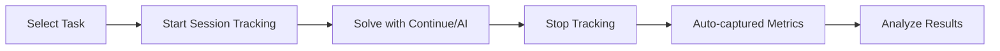

# Vibe Check - AI Coding Agent Benchmark Framework

Test and compare how AI coding assistants perform on real development tasks. Track metrics, analyze results, and find the best AI model for your workflow.

## 🎯 What is Vibe Check?

Vibe Check is a benchmarking framework for evaluating AI coding assistants in realistic development scenarios. Whether you're using Continue, Cursor, or CLI tools, Vibe Check helps you measure and compare AI model performance on actual coding tasks.

## 🚀 Quick Start: Manual Benchmarking with Continue

The fastest way to start benchmarking is using VS Code with the Continue extension - no command line needed!

### Step 1: Install Continue Extension
1. Open VS Code
2. Install the [Continue extension](https://marketplace.visualstudio.com/items?itemName=Continue.continue)
3. Configure it with your preferred AI model (Ollama, OpenAI, Claude, etc.)

### Step 2: Run Setup Wizard
```bash
uv run setup_wizard.py
```
Select **"Manual with Continue"** when prompted for workflow preference.

### Step 3: Start Your First Benchmark
1. Open a benchmark task in VS Code:
   ```bash
   code benchmark/tasks/easy/fix_typo.md
   ```
2. Start session tracking:
   ```bash
   uv run benchmark/continue_session_tracker.py --start
   ```
3. Use Continue (Cmd+L / Ctrl+L) to solve the task with AI assistance
4. Stop tracking when done:
   ```bash
   uv run benchmark/continue_session_tracker.py --stop
   ```

Your session metrics are automatically captured! View results with:
```bash
uv run benchmark/analyze.py
```

**📖 Full Manual Guide:** [docs/manual-benchmarking-guide.md](docs/manual-benchmarking-guide.md)

## 📚 Documentation

### Getting Started
- [**Manual Benchmarking Guide**](docs/manual-benchmarking-guide.md) - Complete guide for Continue workflow
- [**Continue Setup**](docs/continue-setup.md) - Configure Continue for optimal benchmarking
- [**Session Analysis**](docs/session-analysis.md) - Understanding your benchmark metrics
- [**Quick Start Checklist**](QUICKSTART.md) - Step-by-step setup with checkboxes ✅

### Advanced Topics
- [**Automated CLI Benchmarking**](#automated-benchmarking-advanced) - Headless and batch operations
- [**Git Tracking**](docs/git-tracking.md) - Automatic code change tracking
- [**Storage System**](docs/storage.md) - Data persistence and format
- [**All Documentation**](docs/README.md) - Complete documentation index

## 🎯 Manual Benchmarking Workflow



### Why Manual Benchmarking?

- **Realistic Testing** - Mimics actual development workflow
- **Rich Metrics** - Captures conversation flow, edits, and thinking time
- **No Setup Overhead** - Use your existing VS Code + Continue setup
- **Immediate Feedback** - See results as you work

## 📊 Metrics Tracked

During manual benchmarking sessions, we automatically capture:

- **Task Completion** - Success/failure and completion time
- **AI Interactions** - Number of prompts and responses
- **Code Changes** - Files modified, lines added/removed (via git)
- **Session Flow** - Time between interactions, edit patterns
- **Model Performance** - Response quality and accuracy

## 🔧 Prerequisites

### For Manual Benchmarking (Recommended)
- VS Code with [Continue extension](https://marketplace.visualstudio.com/items?itemName=Continue.continue)
- Python 3.8+ and [uv](https://github.com/astral-sh/uv)
- Git (for change tracking)
- An AI model (Ollama, OpenAI, Claude, etc.)

### Installation

```bash
# Install uv (fast Python package manager)
curl -LsSf https://astral.sh/uv/install.sh | sh  # macOS/Linux
# or
brew install uv  # macOS with Homebrew

# Clone and setup
git clone https://github.com/bdougie/vibe-check.git
cd vibe-check
uv pip sync requirements.txt
```

## 📋 Available Tasks

Browse benchmark tasks in `benchmark/tasks/`:

### Easy Tasks (2-5 minutes)
- `fix_typo.md` - Fix documentation typos
- `add_gitignore_entry.md` - Update .gitignore file
- `fix_calculator_typos.md` - Fix multiple typos in calculator

### Medium Tasks (15-30 minutes)
- `add_validation.md` - Add input validation to functions
- `add_export_feature.md` - Implement JSON export functionality
- `add_data_processor_validation.md` - Add comprehensive validation

### Hard Tasks (1-3 hours)
- `refactor_metrics.md` - Refactor the metrics system
- `implement_dashboard.md` - Build a web dashboard
- `algorithm_optimization.md` - Optimize complex algorithms

## 🚀 Automated Benchmarking (Advanced)

For headless operation, batch testing, or CI/CD integration, use the CLI tools:

### Run Automated Benchmarks

```bash
# Single task
uv run benchmark/task_runner.py "ModelName" "benchmark/tasks/easy/fix_typo.md"

# Batch processing
uv run benchmark/batch_runner.py --models "ollama/qwen2.5-coder:7b,gpt-4" --tasks "easy/*"

# With specific models
uv run benchmark/task_runner.py "Claude-3.5-Sonnet" "benchmark/tasks/easy/fix_typo.md"
uv run benchmark/task_runner.py "ollama/codellama" "benchmark/tasks/medium/add_validation.md"
```

### CLI Features
- **Batch Processing** - Run multiple models and tasks automatically
- **Headless Operation** - No UI required, perfect for CI/CD
- **Parallel Execution** - Test multiple models simultaneously
- **Programmatic Access** - Integrate with your existing toolchain

**📖 Full CLI Guide:** [docs/cli-benchmarking.md](docs/cli-benchmarking.md)

## 🎨 Creating Custom Tasks

Create realistic benchmark tasks for your specific use case:

```markdown
# Task: [Task Name]

**Difficulty**: [Easy/Medium/Hard]
**Issue**: [Problem description]

## Requirements
- [Requirement 1]
- [Requirement 2]

## Success Criteria
- [ ] [Criterion 1]
- [ ] [Criterion 2]
```

Save in `benchmark/tasks/{difficulty}/your_task.md`

## 🤝 Contributing

We welcome contributions! Areas of focus:

- **New benchmark tasks** - Add realistic coding challenges
- **Metric enhancements** - Improve tracking and analysis
- **Model integrations** - Support for more AI providers
- **Documentation** - Guides, tutorials, and examples

See [CONTRIBUTING.md](CONTRIBUTING.md) for guidelines.

## 📊 Data Privacy

All benchmark results are stored locally in `benchmark/results/`. No data is sent to external services unless you explicitly share it.

## 🏗️ Roadmap

- [ ] Real-time session visualization
- [ ] Web dashboard for results
- [ ] GitHub issue import for tasks
- [ ] Multi-model comparison UI
- [ ] Team leaderboards
- [ ] Performance regression alerts

## 📄 License

MIT - See [LICENSE](LICENSE) for details.

## 🙏 Acknowledgments

Built to improve human-AI collaboration in software development. Special thanks to:
- [Continue](https://continue.dev) - Excellent VS Code AI extension
- [Ollama](https://ollama.com) - Local model hosting
- Our contributors and early users

---

**Questions?** Open an [issue](https://github.com/bdougie/vibe-check/issues) or check the [docs](docs/).

**Ready to benchmark?** Start with the [manual guide](docs/manual-benchmarking-guide.md) or dive into [automated testing](docs/cli-benchmarking.md)!