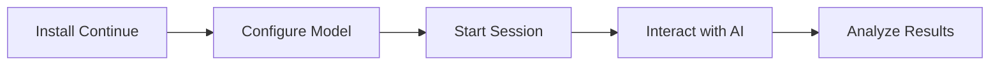
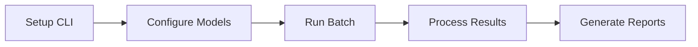

# Vibe Check Documentation

Complete documentation for the Vibe Check AI benchmarking framework. Start with manual benchmarking for immediate, realistic testing.

## 🚀 Quick Navigation

### Start Here
- [**Quick Start Guide**](../QUICKSTART.md) - 10-minute setup with manual benchmarking ✅
- [**Manual Benchmarking Guide**](manual-benchmarking-guide.md) - Complete manual testing workflow 🎯
- [**Continue Setup**](continue-setup.md) - Configure Continue extension for benchmarking

## 📚 Documentation Structure

### Manual Benchmarking (Recommended)
The preferred way to benchmark - realistic, interactive testing with immediate feedback.

- [**Manual Benchmarking Guide**](manual-benchmarking-guide.md) - Complete guide for Continue workflow
- [**Continue Setup**](continue-setup.md) - Detailed Continue configuration
- [**Session Analysis**](session-analysis.md) - Understanding your benchmark metrics
- [**Continue Session Tracking**](continue-session-tracking.md) - How metrics are captured

### Automated Benchmarking (Advanced)
For batch testing, CI/CD integration, and headless operation.

- [**CLI Benchmarking Guide**](cli-benchmarking.md) - Command-line automation
- [**Setup Guide**](setup.md) - Environment configuration for automation
- [**Manual Guide**](manual-guide.md) - Legacy manual instructions

### Core Features
- [**Git Tracking**](git-tracking.md) - Automatic code change tracking
- [**Storage System**](storage.md) - Data persistence and format
- [**Models Configuration**](models.md) - AI model setup and configuration

### Local Development
- [**Ollama Setup**](ollama.md) - Local model hosting with Ollama
- [**Continue Config Generator**](continue-config.md) - Auto-generate Continue config
- [**Pre-commit Hooks**](pre-commit-setup.md) - Code quality automation

## 🎯 Choose Your Path

### Path 1: Manual Benchmarking with Continue (Recommended)

Best for developers who want to:
- Test AI models in realistic scenarios
- Get immediate visual feedback
- Use their existing VS Code workflow
- Understand AI behavior patterns



**Start here:** [Manual Benchmarking Guide](manual-benchmarking-guide.md)

### Path 2: Automated CLI Benchmarking

Best for teams who need:
- Batch processing capabilities
- CI/CD pipeline integration
- Headless operation
- Programmatic access



**Start here:** [CLI Benchmarking Guide](cli-benchmarking.md)

## 📊 What Gets Measured

### Manual Sessions
During interactive benchmarking with Continue:
- **Interaction Flow** - Prompts, responses, and timing
- **Code Changes** - Files modified, lines added/removed
- **Session Metrics** - Duration, success rate, iterations
- **Model Performance** - Response quality and accuracy

### Automated Runs
During CLI benchmarking:
- **Task Completion** - Success/failure status
- **Execution Time** - Total duration
- **Resource Usage** - Tokens, API calls
- **Code Quality** - Test results, lint status

## 🔍 Quick Reference

### Manual Benchmarking Commands

```bash
# Start session tracking
uv run benchmark/continue_session_tracker.py --start

# Stop and save session
uv run benchmark/continue_session_tracker.py --stop

# Analyze latest session
uv run benchmark/analyze.py --session latest
```

### Automated Benchmarking Commands

```bash
# Single task
uv run benchmark/task_runner.py "model" "task.md"

# Batch processing
uv run benchmark/batch_runner.py --models "model1,model2" --tasks "*.md"

# Quick smoke test
uv run run_smoke_test.py
```

### Analysis Commands

```bash
# View all results
uv run benchmark/analyze.py

# Compare models
uv run benchmark/analyze.py --compare "model1" "model2"

# Export to CSV
uv run benchmark/analyze.py --export csv
```

## 📁 Project Structure

```
vibe-check/
├── benchmark/
│   ├── tasks/              # Benchmark tasks by difficulty
│   │   ├── easy/           # 2-5 minute tasks
│   │   ├── medium/         # 15-30 minute tasks
│   │   └── hard/           # 1-3 hour tasks
│   ├── results/            # Benchmark results storage
│   │   └── sessions/       # Manual session data
│   ├── continue_session_tracker.py  # Manual session tracking
│   ├── task_runner.py      # CLI task runner
│   └── analyze.py          # Results analysis
├── docs/                   # This documentation
├── sample_project/         # Test environment
└── QUICKSTART.md          # Quick start guide
```

## 🎨 Task Categories

### Easy Tasks (2-5 minutes)
- Fix typos and syntax errors
- Add simple features
- Update configuration files

### Medium Tasks (15-30 minutes)
- Add validation logic
- Implement data processing
- Create utility functions

### Hard Tasks (1-3 hours)
- Refactor complex systems
- Optimize algorithms
- Design new architectures

## 🤝 Contributing

### Documentation Guidelines
1. Prioritize manual benchmarking in examples
2. Use clear, concise language
3. Include practical examples
4. Add workflow diagrams where helpful
5. Keep CLI/advanced topics separate

### Adding New Documentation
1. Place in appropriate category (manual vs automated)
2. Update this index
3. Add to relevant guides
4. Include in QUICKSTART if essential

## 🔗 External Resources

- [Continue Documentation](https://docs.continue.dev) - Continue extension docs
- [Ollama Documentation](https://ollama.com/docs) - Local model hosting
- [GitHub Repository](https://github.com/bdougie/vibe-check) - Source code
- [Issue Tracker](https://github.com/bdougie/vibe-check/issues) - Report problems

## 📈 Metrics Explained

### Success Metrics
- **Task Completion** - Did the AI solve the problem?
- **Code Quality** - Is the solution clean and correct?
- **Efficiency** - How many prompts were needed?
- **Time** - How long did it take?

### Performance Metrics
- **Response Time** - AI response latency
- **Token Usage** - Computational resources used
- **Cost** - API costs for commercial models
- **Accuracy** - Correctness of solutions

## 🛠️ Troubleshooting

### Common Issues
- [Continue not responding](continue-setup.md#troubleshooting)
- [Session not recording](manual-benchmarking-guide.md#troubleshooting)
- [Model connection failures](models.md#troubleshooting)
- [Ollama setup problems](ollama.md#common-issues)

### Getting Help
1. Check relevant documentation section
2. Search [existing issues](https://github.com/bdougie/vibe-check/issues)
3. Open a new issue with details
4. Join our community discussions

## 📄 License

See [LICENSE](../LICENSE) in the repository root.

---

**Ready to start?** → [Quick Start Guide](../QUICKSTART.md) | [Manual Benchmarking](manual-benchmarking-guide.md) | [CLI Benchmarking](cli-benchmarking.md)

*Documentation focused on manual benchmarking workflow - Last updated: November 2024*